# Rainy 文稿台


`v0.2.0` · [MIT License](LICENSE)

功能截图可点击查看原图，均来自本机 Arc 中的演示资料库。

在本机浏览器里写 Markdown＋HTML，预览文章排版并检查格式；首套默认配置面向微信公众号，也可通过资料库配置定制其它平台。

文稿、主题快照、图片、设置和历史保存在你选择的本地资料库中。应用提供静态页面；资料目录的读写由浏览器在你授权后完成。

[快速开始](#快速开始) · [第一次使用](#第一次使用) · [教程](AGENT-GUIDE.md#编号教程) · [主题制作](THEME.md) · [格式配置](FORMAT.md) · [常见问题](#常见问题)

## 界面预览

[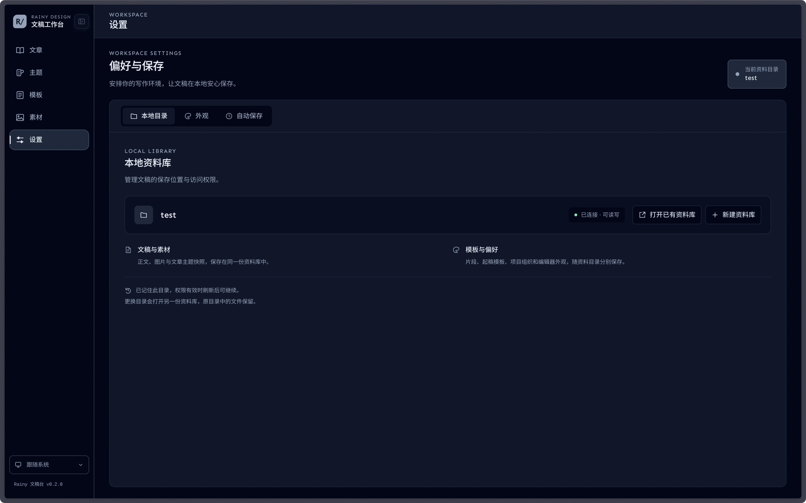](public/image/local-library.webp)
[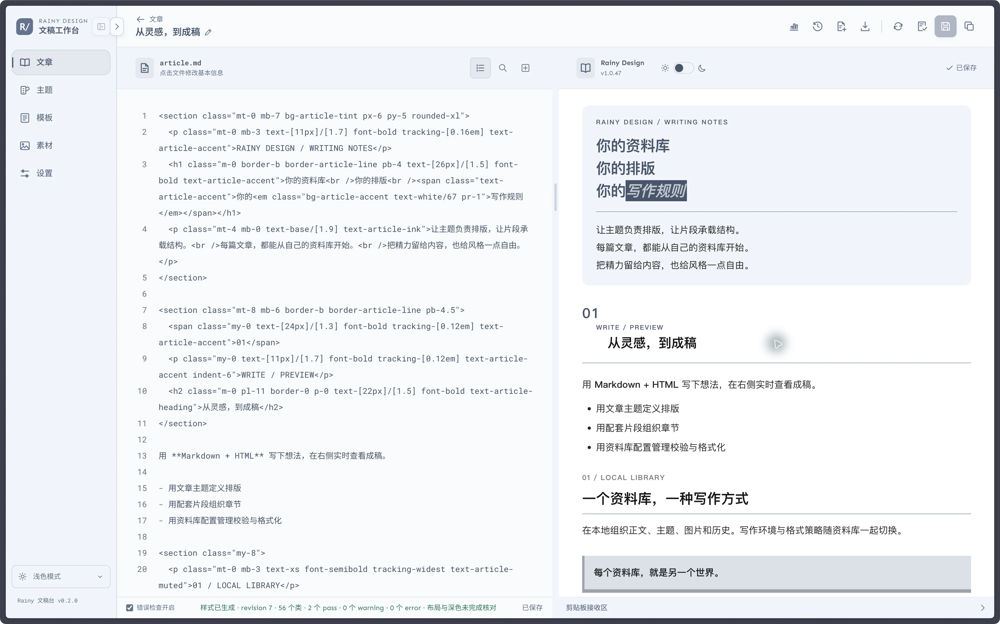](public/image/editor-slate-light.webp)
[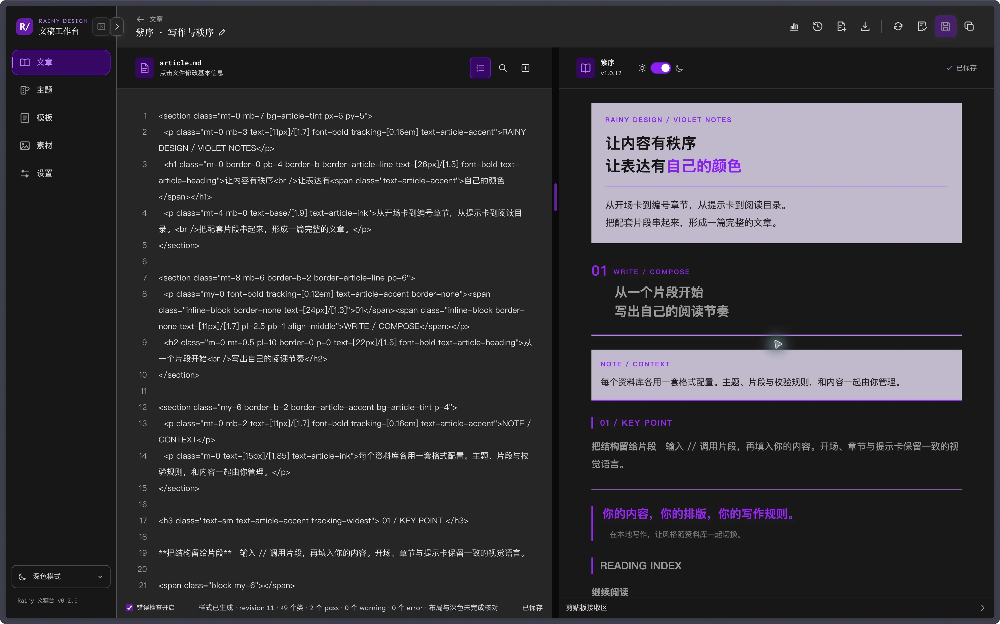](public/image/editor-violet-dark.webp)
[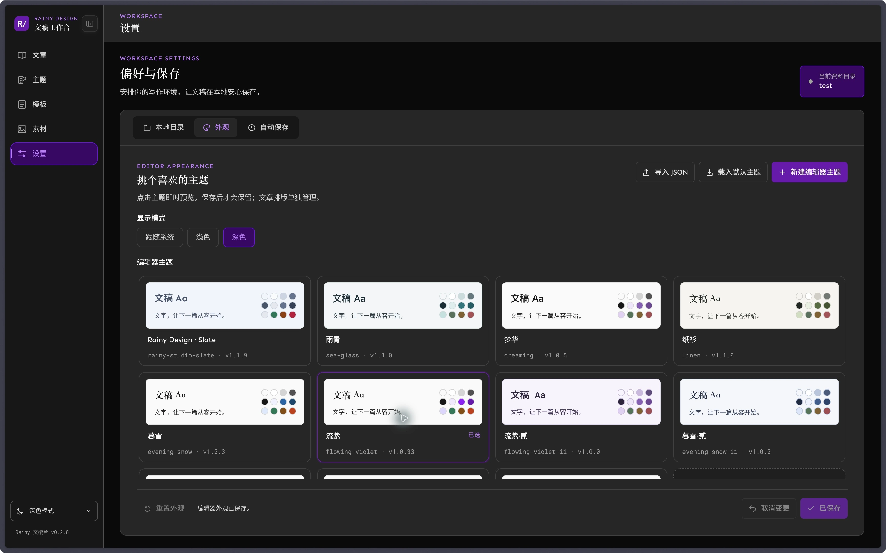](public/image/editor-themes.webp)
[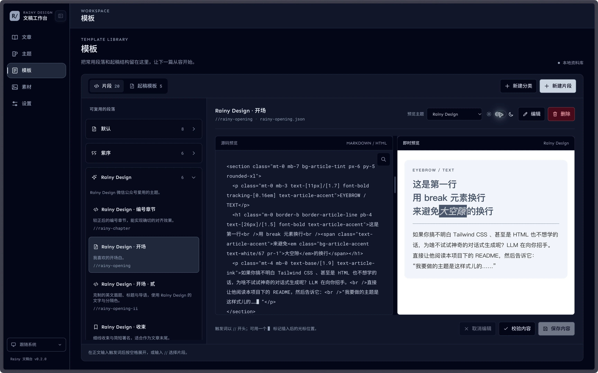](public/image/snippets.webp)
[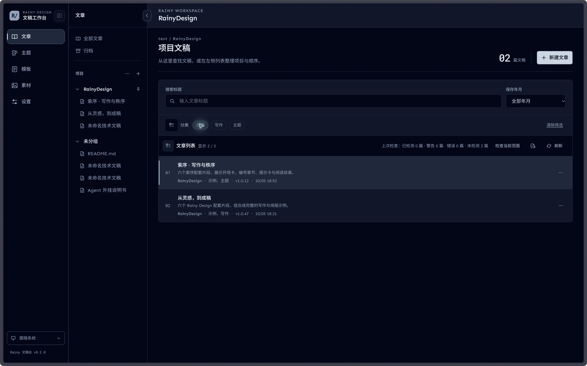](public/image/article-list.webp)
[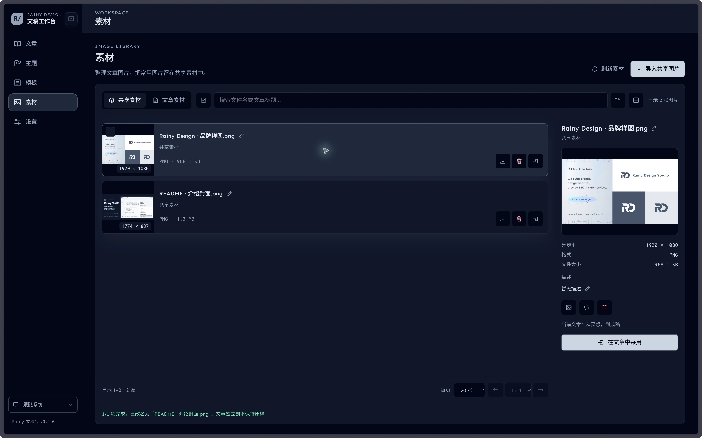](public/image/media-library.webp)
[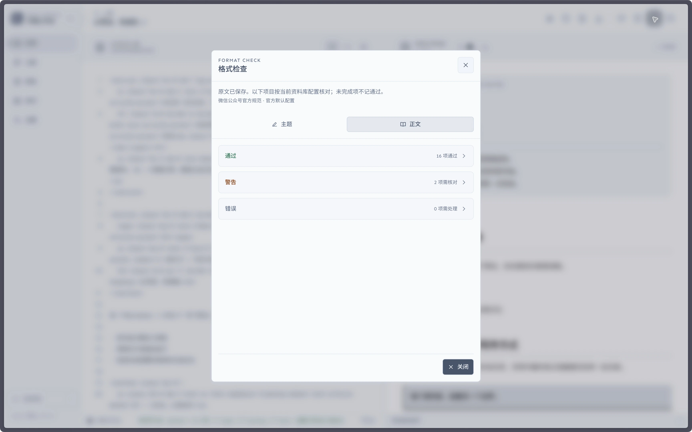](public/image/format-check.webp)

## 功能与特性

- **外置资料库**：编辑器主题、文章主题、片段、起稿模板、文章、历史记录，甚至是格式清单、校验和排版策略，都按资料库解耦，一个资料库就是另一个世界。
- **纯本地管理**：文章资料在本机浏览器中处理，即使通过在线页面使用，管理的也是你自己的本地资料库。
- **真渲染预览**：左侧写源码，右侧看预览；预览、复制与可视导出共用渲染和格式处理流程，排版与图片都能先在本地核对。
- **主题自定义**：主题分两种，编辑器和文章，这里说的是前者，字体颜色随你换。
- **模板随心建**：用起稿模板组织文章，用片段复用提示卡、章节等内容，后者只要在文中输入 `//` 即可快捷插入。
- **分组与归档**：按项目、分类和年月整理文章，支持归档、Fork 和历史快照，还可为文章设置分类，方便二级查找。
- **内置素材库**：一键管理共享图片与文章图片：搜索、筛选、排序、多选、移动／复制、改名、描述、替换、删除、预览缩放和分页。
- **外置检测器**：每个资料库各用一套规范、validator 与 formatter；平台规则、换行、预览背景和转换策略在 JSON 中配置。
- **格式检查**：在撰写时提示格式和本地图片问题；保存与复制前仍会提供独立检查结果，方便查看哪里还要改。
- **文档导出**：保存文稿，导出文档包、Markdown、长图片或 PDF；具体入口以应用中的导出菜单为准。

现有内置内容包含 7 套文章主题、11 套编辑器主题、20 个片段和 5 个起稿模板。也可以制作自己的内容。

## 快速开始

### 交给 Agent 安装

复制下面这段话到一个上下文较少的干净 Agent 会话：

> 请先阅读这个项目的 README.md 和 AGENT-GUIDE.md，帮我安装并使用 Rainy 文稿台。先解释本地应用与资料库的区别，与我对齐安装目录、端口和权限；我确认继续后再克隆、安装和启动。仓库中维护者的本机路径不是我的安装位置，操作路径以我确认的目录为准，并遵循当前环境的授权规则。默认按 README 的 npm 方法启动，打印实际目录和启动命令，不另行生成 PowerShell／CMD／Shell 启动脚本。安装后引导我在浏览器中授权目录、初始化资料库，再简短介绍四个编号教程。

**Agent Readable：先读 [AGENT-GUIDE.md](AGENT-GUIDE.md)，制作内容时再读 [THEME.md](THEME.md)。** 仓库地址以使用者提供的克隆地址为准；本项目目前处于 GitHub 发布准备阶段。

### 自己启动

准备 Git、Node.js 24 LTS（含 npm）和桌面浏览器。本项目统一使用 npm，依赖由 `package-lock.json` 固定。macOS 的 Arc 已用于本地目录和剪贴板走查；浏览器需要提供 File System Access 目录授权能力，桌面 Chrome／Edge 是应用建议入口。其它系统／浏览器组合的实际目录和剪贴板行为需自行确认。

获得源码后，在项目目录安装依赖、构建并启动：

```sh
npm install
npm run build
npm start
```

打开终端打印的本机地址，并保持服务运行。

默认地址为 `http://127.0.0.1:3500`。需要其它端口时用 `npm start -- --port 3501`（替换为已确认端口）；启动帮助用 `npm start -- --help`。端口占用时服务退出，不会自动结束已有进程。

构建完成后，后续在同一项目目录执行 `npm start` 即可启动。源码更新后重新安装所需依赖、构建并重启。启动脚本会复用已有的 `out/` 静态产物；缺少 `out/index.html` 时明确提示先执行 `npm run build` 并退出，不会隐式构建。

## 第一次使用

1. 打开“设置 → 本地目录 → 新建资料库”，输入资料库文件夹名称，然后选择父目录并授权读写。应用会创建一个命名子目录；同名目录已存在时，请改名或使用“打开已有资料库”。
2. 已有资料库直接使用“打开已有资料库”，选择资料库本身。应用只记住最后一个目录书签；权限失效时需重新授权。
3. 新建文章，输入正文并保存（macOS `⌘S`，其它系统 `Ctrl+S`）。文章目录和主题快照在保存时生成。
4. 在“主题”中试看文章主题。已保存文章使用“复制并应用”，生成副本并保留原稿和主题快照；未保存新稿使用“应用到当前稿”。
5. 在“模板”中管理片段和起稿模板；在编辑器里通过“插入元素”或输入片段触发词采用。
6. 在“素材”中导入共享图片，或为文章导入图片。采用共享图片会复制到文章自己的 `media/image/`；共享原件与文章副本独立。
7. 复制富文本，先在剪贴板接收区核对；回到公众号编辑页由使用者手动粘贴，并检查草稿和手机预览。

窗口窄时可切换源码／预览。目录授权、素材操作和公众号编辑以桌面浏览器为主要使用场景。

[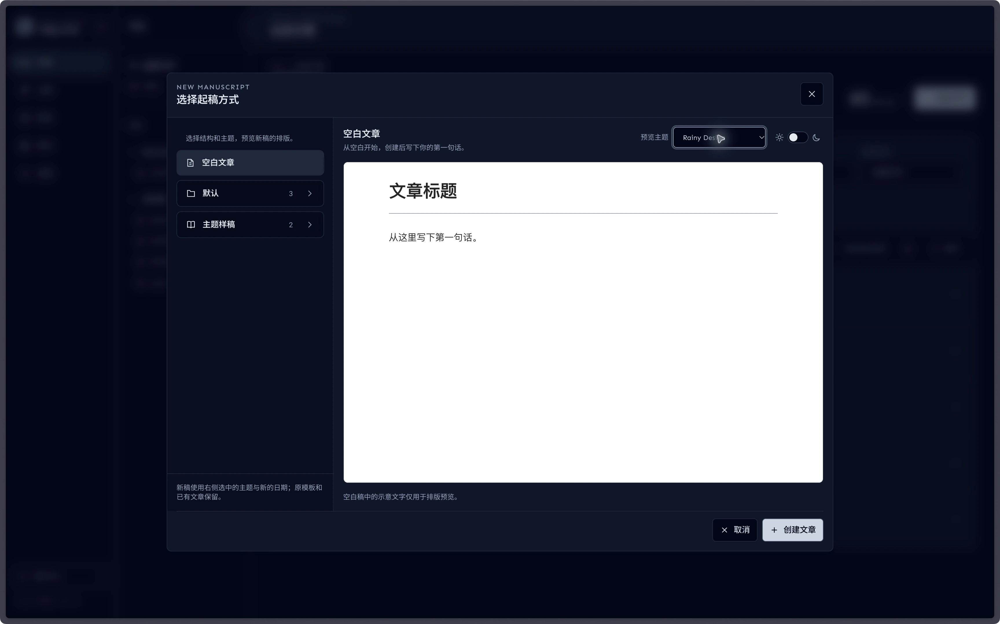](public/image/new-manuscript.webp)

[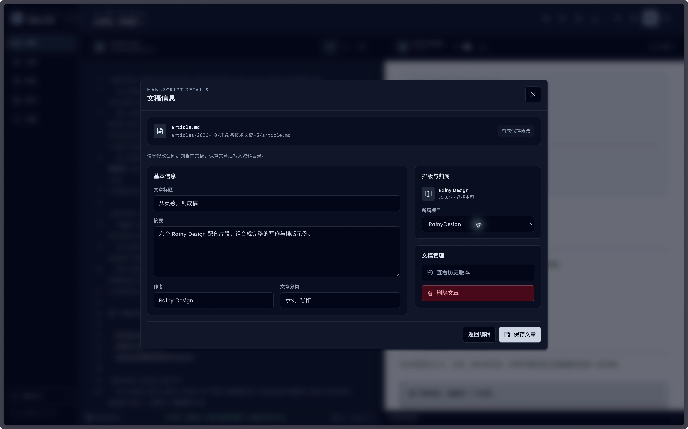](public/image/article-info.webp)

### 文章列表、分类与检查

列表从月索引读取摘要，打开文章时再读取该篇正文和主题快照。全部文章、未分组与项目显示未归档文章；归档单独显示。分类来自当前集合。

“检查当前范围”检查当前搜索、年月及分类筛选后的文章，可查看进度或取消。汇总按篇计数；未检测、需重检和检查失败分别显示。记录只在当前资料库会话复用，表示上次检查结果；修改正文、主题或格式配置后需重新检查。

分类左侧的多选图标进入标签管理。勾选要移除的标签，再确认当前筛选范围和受影响篇数；操作只移除文章中的这些标签。归档分类可筛选，移除标签需先取消归档。

外部直接修改文件后，在列表的索引修复入口主动扫描并重建。旧索引缺字段或索引损坏时会提示列表可能不完整；重建读取提示中的年月，保留原稿及损坏文章的诊断。仅“刷新”会重新读取索引，不会扫描全部正文。

## 两类主题与四个教程

| 想做什么 | 去哪里 |
|---|---|
| 主题＋正文＋片段一次完成文章 | [教程 1](AGENT-GUIDE.md#教程-1整篇文章) |
| 按字体、颜色和对比度偏好定制文稿台 | [教程 2](AGENT-GUIDE.md#教程-2编辑器主题) |
| 设计文章主题、正文、片段和起稿模板并测试 | [教程 3](AGENT-GUIDE.md#教程-3设计与测试) |
| 将本地 Markdown 文件整理并导入新文章 | [教程 4](AGENT-GUIDE.md#教程-4导入本地-markdown-文件) |
| 查字段、文件格式、完整示例和验证步骤 | [THEME.md](THEME.md) |

`editor-theme` 控制文稿台界面；`article-theme` 控制文章排版与输出。更换界面外观不会重写文章主题快照。

这些教程由你正在使用的外部 Agent 读取并引导。文稿台没有内置 AI，也不会自行登录公众号或发布文章。

## 资料库与备份

下面是使用过程中陆续生成的结构，目录和文件随实际操作出现：

```text
资料库/
├── settings.json                    # 保存工作流、组织及外观后生成
├── format/                          # 新库生成一套配置
│   ├── format-support.json
│   ├── validator.json
│   └── formatter.json                # steps[]
├── fonts/                           # 预设本地字体与原许可文件
├── themes/
│   ├── article-themes/<id>.json
│   └── editor-themes/<id>.json
├── snippets/
│   ├── index.json                    # 分类索引
│   └── <分类>/<id>.json
├── templates/
│   ├── index.json
│   └── <分类>/<id>.md
├── articles/YYYY-MM/
│   ├── index.json                    # 可重建月索引
│   └── <文章目录>/
│       ├── article.md
│       ├── theme.json                # 文章独立主题快照
│       ├── media/image/              # 文章图片及可选描述索引
│       └── history/snapshot-…/       # 源码、主题与快照清单
└── shared/image/                     # 首次导入共享图片时创建
```

新建流程创建顶层目录及格式三件套，文章目录为空，随后加载内置主题、片段和模板，并复制预设本地字体及原许可文件。新库没有 `settings.json` 时先使用默认值，明确保存设置后再写入。旧布局迁移保留原文件，主题子目录可能包含迁移标记。

**代码目录与资料库分开备份。** 文章源码、元数据和主题快照随文章保存，图片随完整文章目录保留。历史快照不包含图片文件的完整备份，也不能替代整库备份。

定期将整个资料库复制到独立位置，并抽查文件可读；恢复前保留现有资料副本。月索引是缓存，重建索引不等于恢复丢失的正文。仓库忽略的 `data/`、浏览器书签和 `out/` 都不应被误当作资料备份。

[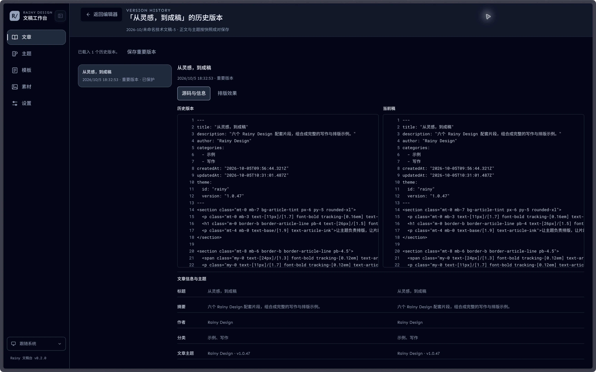](public/image/history.webp)

## 常见问题

| 现象 | 处理 |
|---|---|
| 启动端口占用 | 换一个已确认可用的端口，或由使用者处理已有服务；不要自动结束不明进程 |
| 界面仍是旧版本 | 源码更新后重新构建，重启静态服务并刷新浏览器 |
| 目录权限失效 | 在“设置 → 本地目录”重新打开原资料库并授权 |
| 切换端口后找不到已记住的资料库 | 不同地址属于不同浏览器来源，需重新选择目录；磁盘文件仍在 |
| 源码有图片引用，预览找不到图片 | 检查对应文章的相对路径及实际文件；错误检查会区分缺失与暂无法读取 |
| 复制时图片读取失败 | 修复文件或权限后重试；准备失败不会被报告为整篇复制成功 |
| 改动后预览未更新 | 保存或点击更新样式，核对生成状态和格式报告 |
| 外部改文稿后列表信息仍旧，或索引需要修复 | 主动扫描并重建对应月索引；不要根据不完整索引判断文章已丢失 |
| 格式配置报错 | 按 FORMAT.md 修复整套配置，再保存草稿并重新打开资料库；缺文件或旧格式不会与默认文件混配 |
| 主题 JSON 导入失败 | 检查两类主题格式、字段、ID／文件名及同名冲突，参见 THEME.md |
| 公众号接收效果不同 | 核对微信草稿和手机预览；先用已测范围的写法，并查看格式报告 |

## 支持范围

Node.js 24 为 [官方 LTS 分支](https://nodejs.org/en/about/previous-releases)。本轮验证环境及通过范围见交付回执；不要把框架的最低 Node 版本当作全部测试工具的已验证版本。

- 常用 Markdown/GFM、受控 HTML、文章主题和 Tailwind 文章工具类。
- 整篇多图混排复制的公众号实验已在 macOS 接收方由用户验证；这不构成全部图片格式、浏览器或接收应用的兼容承诺。
- 微信公众号默认规范以[微信官方编辑器插件规范](https://developers.weixin.qq.com/doc/service/guide/product/plugin_spec.html)为依据。即时、布局／深色与人工核对分别报告；旧版格式分级和粘贴实测不作为本版官方合规证明。配置、来源、覆盖及迁移见[FORMAT.md](FORMAT.md)。
- 公式／Mermaid、同稿协作、公众号 API 与自动发布属于后续或范围外事项。
- 应用是单 Next.js 静态项目，没有业务后端、数据库或服务器端文章保存。静态服务只监听本机地址，不提供资料目录接口。
- 首次安装和构建需要取得依赖；页面及本地资源加载完成后的编辑／保存以本机文件为基础。不要把这一点解释为已提供离线安装包或完整 PWA 缓存。

## 开发与贡献

```sh
npm run dev
npm run typecheck
npm test
npm run build
```

`npm run dev` 默认使用 3500；使用前核对同端口服务，避免与日常静态服务冲突。依赖由 `package-lock.json` 固定，更新依赖时一并核对受影响范围；按锁文件复现依赖可用 `npm ci`。

反馈问题时提供应用版本、系统／浏览器、操作步骤、预期和实际结果；涉及资料时使用可分享的最小样例。贡献代码、主题或片段时先复现，再验证保存、预览与对应输出。真实目录权限、系统剪贴板和微信接收方检查分别记录，不能用自动测试代替。

当前代码源和版本见 [package.json](package.json)，功能变化也可在应用版本按钮中查看。本项目采用 [MIT License](LICENSE)。随附字体和第三方资源沿用各自许可，详见原资源文件与包信息；GitHub 仓库及远端推送由维护者确认。

## 文档设计依据

入口组织参考 [MarkText README](https://github.com/marktext/marktext/blob/develop/README.md) 的功能／安装／开发分段，以及 [HedgeDoc README](https://github.com/hedgedoc/hedgedoc/blob/develop/README.md) 对快速入口、项目状态和独立指南的组织。本站文档、命令和示例按本项目实现编写。
